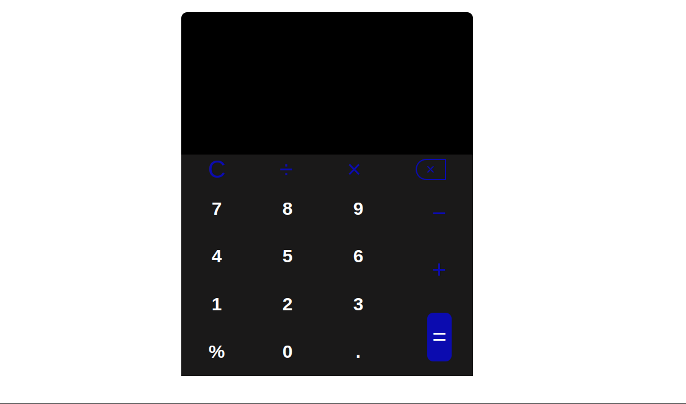

# CALCULATOR

   

#### Created By: **Alfred Warui**

## Description

This calculator application works like a normal calculator except that it is not integrated with the complex operations.

## Getting the app

- Clone it from github using either HTTPS or SSH
- Then run it locally using live server

## Known Bugs

There are no known bugs.

## Site

### License

- _License under [MIT License](LICENSE)_
